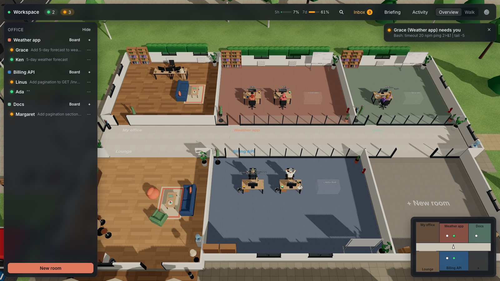
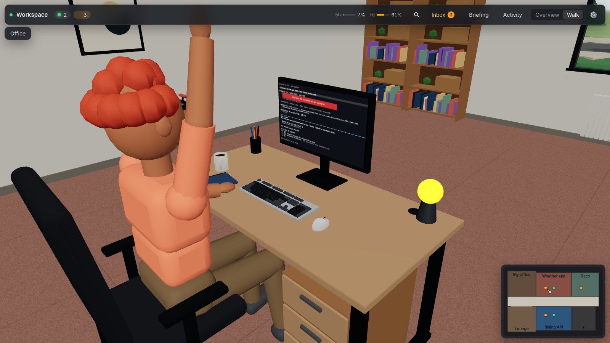
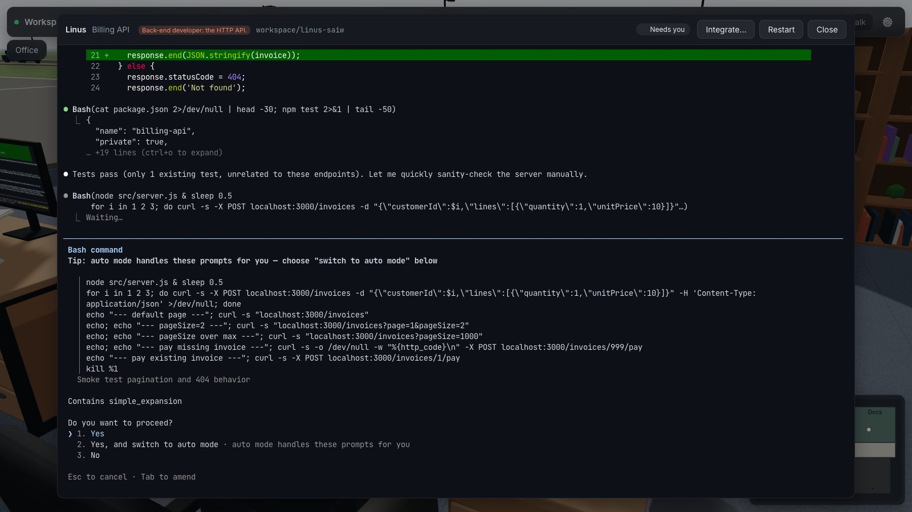
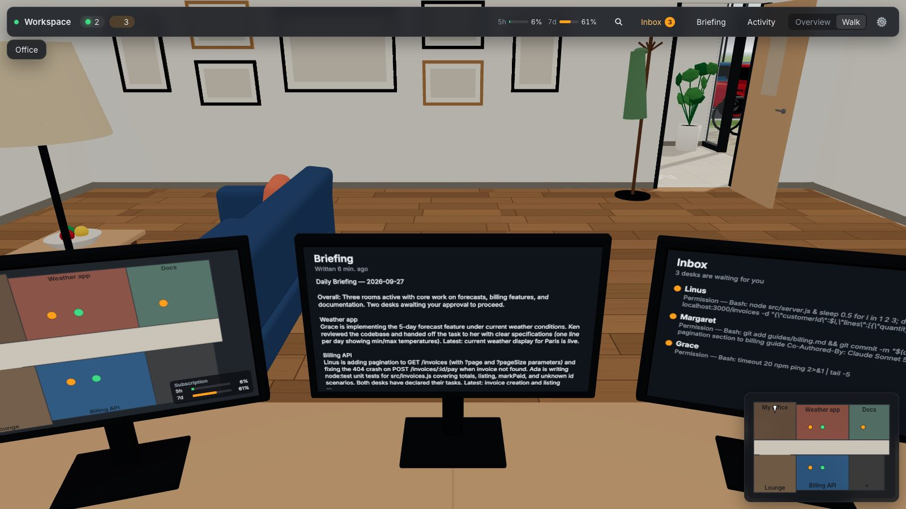
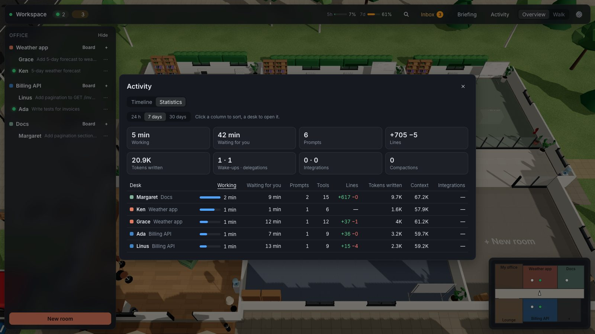
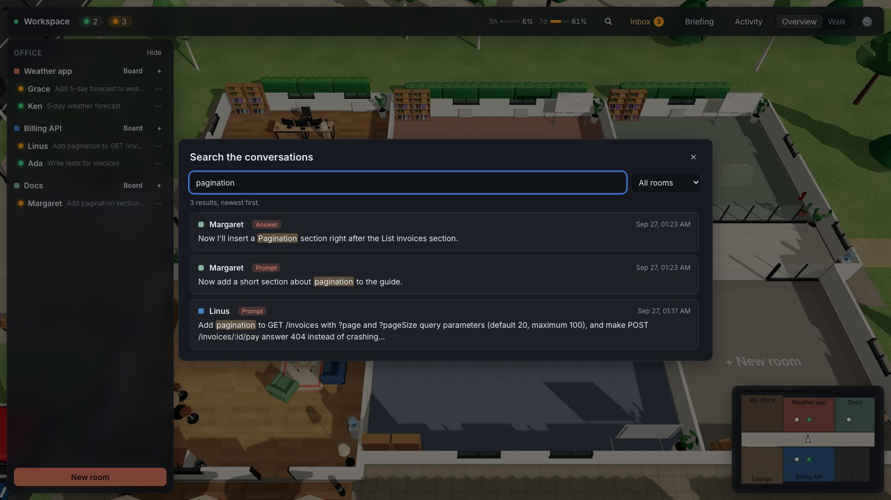
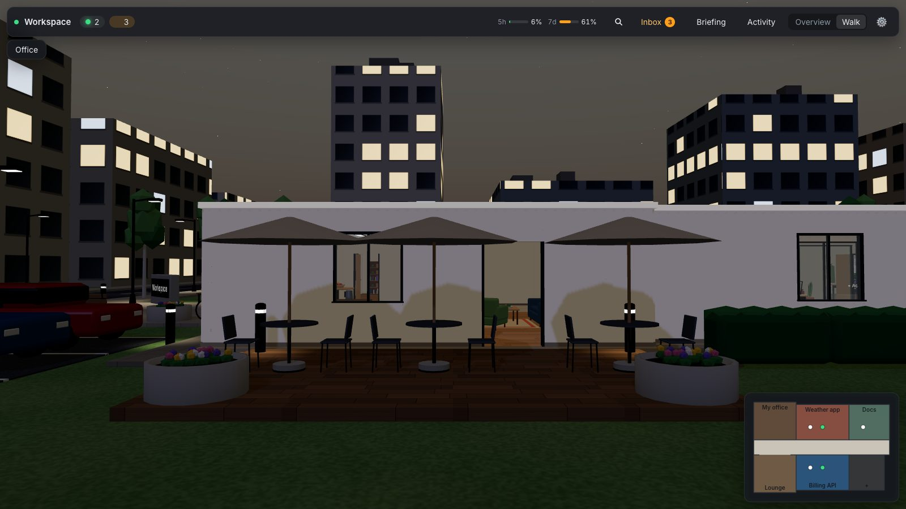

# Workspace

A 3D office in the browser for supervising many Claude Code sessions at once. Each **room** is a
project, each **desk** a live Claude Code session running on your machine or server. You see at a
glance who is working, who needs you and what everyone is doing; you walk up to a desk to open its
terminal, and the desks of a room coordinate with each other.



> **Built entirely with Claude Opus 5.5**, at the **xhigh** effort level, in Claude Code: the
> server, the web client, the 3D models (Blender scripts), the sound pipeline and this documentation.

The roadmap and design live in [`PLAN.md`](PLAN.md), the idea backlog in [`IDEAS.md`](IDEAS.md), and
the Linux server guide in [`docs/deployment.md`](docs/deployment.md).

## Screenshots

| | |
|---|---|
|  |  |
| **A desk up close**: the screen mirrors the session live; this desk needs you, so its lamp lights up and its character raises a hand. | **The terminal**: the real Claude Code interface, opened over the office — here a desk asking for permission. |
|  |  |
| **Your desk** in the master office: office map, briefing and inbox, a gallery wall behind. | **Activity**: timeline and statistics per desk. |
|  |  |
| **Search** across every desk's prompts and answers. | **At night** on the lounge's terrace: the light follows your local time. |

The screenshots show a demo office (three small example projects, desks on Sonnet) and are taken
by `pnpm screenshots` (see [Development](#development)).

## Features

**The office**

- Rooms line a corridor; each desk shows its session's screen live, and its lamp shows its state:
  blue working, orange needs you, green idle, purple compacting, yellow usage limit, red error,
  off stopped.
- Two views: an **overview** of the building with walls cut away, and a **first-person walk**.
- A master office at the entrance (your desk: office map, briefing, inbox, a wall TV with the day's
  timeline, a gallery wall for your own pictures), a lounge with a terrace, and a neighborhood around
  the building: streets, a park, street lamps at night.
- Living office: the light follows your local time of day, idle characters take coffee breaks, walk
  to a colleague they write to, and hurry back when they are needed.
- Recorded soundscape: room tone indoors, birds by day and insects by night outdoors, keyboards at
  the desks that are working, footsteps matching the floor.

**Working with desks**

- A desk works either in its own **git worktree** (own branch, no conflicts) or directly in the
  project folder. It can have a model, a permission mode, a first instruction and a role.
- The terminal opens over the office (xterm.js, the real Claude Code TUI); sessions live in a
  dedicated tmux server, so they survive server restarts and resume after a reboot.
- **Integrate** a worktree desk's work: diff, merge into a branch, or open a pull request with `gh`.

**Teamwork between desks**

- Every session gets an `office` MCP server: `colleagues`, `set_task`, `send_message`,
  `read_messages`, `delegate`, `board`, `post_note`, `remove_note`.
- New messages are added to a desk's context; an idle desk is woken up when it gets one (per room,
  rate-limited so desks cannot keep waking each other).
- Room templates (solo, duo, team with a lead) create desks with roles and first instructions.

**Supervision**

- **Inbox** of the desks waiting for you, **briefing** of what happened since your last visit
  (written by Claude Haiku through the `claude` CLI), **activity** timeline and statistics per desk
  over 24 h / 7 / 30 days (working and waiting time, prompts, tools, lines written, tokens, context,
  integrations).
- **Search** across every desk's prompts and answers, ignoring case and accents.
- **Subscription gauge**: 5-hour and weekly usage of the Claude subscription, with alerts at 80 %
  and 95 %.
- **Notifications**: in-app toasts and chimes, browser notifications, and phone notifications
  through a Discord webhook, sent only while no Workspace tab is visible; each message links to the
  desk's terminal.

**Languages**

- The interface, the phone notifications and the briefing are available in English, French,
  German, Spanish, Italian, Portuguese (Brazil), Russian, Japanese, Korean and Chinese (Simplified).

## Controls

| Where | Input | Action |
|---|---|---|
| Overview | click a desk / a whiteboard / a `+` | open the terminal / the room board / add a desk or a room |
| Overview | drag, right-drag, scroll | orbit, pan, zoom |
| Office | `V` | switch between the overview and the walk |
| Office | `⌘K` / `Ctrl+K` | search the conversations |
| Walk | mouse | look around (the mouse is captured while walking) |
| Walk | `WASD` / `ZQSD` / arrows, `Shift` | move, run |
| Walk | `E` or click | use what is under the crosshair: desk, board, screen, frame, or sit down |
| Walk | `Esc` | back to the overview (`V` resumes the walk where you left it) |
| Dialogs | `Esc` | close the dialog on top (in a terminal, `Esc` goes to Claude Code) |

## How it works

```
browser (React, react-three-fiber)  ──HTTP / WebSocket──  server (Fastify, Node 24)
                                                            ├─ SQLite: rooms, desks, events, boards
                                                            ├─ tmux server: one session per desk
                                                            │    └─ claude  ──hooks (HTTP)──▶ server
                                                            │         └─ office MCP (stdio) ──▶ server
                                                            └─ git / gh for worktrees and integration
```

Claude Code hooks report every event of a session (prompt, tool use, permission request, stop…) to
the server, whose state machine turns them into the desk states shown in the office. The server
mirrors each session's screen for the live previews and relays the interactive terminal.

## Requirements

- Node 24+ and pnpm 10+
- `tmux`, `git`, `curl`; `gh` (logged in) to open pull requests
- Claude Code CLI (`claude`), logged in with the subscription every desk will use
- A recent Chromium-based browser (developed and tested with Chrome)
- Only to regenerate assets: Blender 5.1+ (3D models), ffmpeg and Python with numpy (sounds)

## Getting started

```sh
pnpm install
pnpm set-password     # once: the password protecting the office
pnpm dev              # server on :4317, web client on http://localhost:5317
```

Create a room from a project folder, add desks, and open one to give it its first instruction.

## Production

`pnpm build` builds the web client, then `pnpm start` runs a single process that serves it on
http://127.0.0.1:4317 (no Vite, no file watching). Only one server should use a given data
directory and tmux socket at a time: stop `pnpm dev` before `pnpm start` on the same machine.
[`docs/deployment.md`](docs/deployment.md) covers a Linux server with systemd, HTTPS, updates and
backups.

```sh
pnpm build
pnpm start
SMOKE_URL=http://127.0.0.1:4317 SMOKE_PASSWORD=... pnpm smoke   # browser smoke test (installed Chrome)
```

## Configuration

Environment variables of the server:

| Variable | Default | Purpose |
|---|---|---|
| `WORKSPACE_HOST` | `127.0.0.1` | Address the server binds to |
| `WORKSPACE_PORT` | `4317` | HTTP / WebSocket port |
| `WORKSPACE_DATA_DIR` | `~/.workspace` | Database, per-desk runtime files, worktrees, pictures |
| `WORKSPACE_TMUX_SOCKET` | `workspace` | Name of the dedicated tmux server socket |
| `WORKSPACE_CLAUDE_BIN` / `WORKSPACE_TMUX_BIN` / `WORKSPACE_NODE_BIN` | from `PATH` | Executables to use |
| `WORKSPACE_HOOK_BASE_URL` | `http://<host>:<port>` | URL Claude Code hooks call back |
| `WORKSPACE_SECURE_COOKIES` | unset | Set to `1` when served over HTTPS |
| `WORKSPACE_RECORD_HOOKS` | unset | Set to `1` to log raw hook payloads to `<data dir>/hook-log.jsonl` |
| `WORKSPACE_DESK_ENV_PASS` | unset | Comma-separated variables desks may see although their names look like secrets (e.g. `NPM_TOKEN`) |

Viewer preferences (graphics quality, sound volumes, language, notifications) are in the ⚙ menu;
graphics quality **Eco** keeps laptops cool.

## Security and data

- **Anyone who can log in gets a shell** as the user running the server: desks run Claude Code with
  that user's rights. Keep the server on `127.0.0.1` or a private network (VPN, Tailscale), behind
  HTTPS, with a strong password.
- Everything Workspace stores is in `WORKSPACE_DATA_DIR`: `workspace.db` (SQLite), `desks/`
  (generated launch files), `worktrees/`, `pictures/`. Conversations stay where Claude Code keeps
  them (`~/.claude/projects/`); Workspace reads them for statistics and search.
- The Discord webhook URL never leaves the server; the browser only sees a masked hint.
- Desk work is never lost: deleting a worktree desk keeps its branch.

### Secrets and isolation between desks

- **Env files**: a worktree desk gets a fresh `git worktree`, which only contains tracked files, so
  git-ignored files such as `.env` are not in it. A room can list the ones its desks need (room
  board → *Files copied into worktree desks*): each worktree desk gets a copy when it is created, and
  existing desks get the files they miss when the list changes. Only files git ignores are accepted,
  so a copy can never be committed. A shared-folder desk works in the project folder itself and sees
  its `.env` files as they are.
- **Environment variables**: a session inherits the environment of the Workspace server, **minus
  every variable whose name looks like a secret** (`*TOKEN*`, `*SECRET*`, `*PASSWORD*`, `*API_KEY*`,
  `*CREDENTIAL*`, `*PRIVATE_KEY*`, …). Claude Code's own variables (`CLAUDE_*`, `ANTHROPIC_*`), the
  SSH agent and the desk's `WORKSPACE_DESK_TOKEN` (which only authenticates it to its own office
  endpoints) are kept; list others desks need in `WORKSPACE_DESK_ENV_PASS`.
- **Commits**: *Integrate → Commit* refuses files that look like secrets (`.env`, `*.pem`, `*.key`,
  SSH private keys, `.netrc`, …; templates such as `.env.example` are fine) and says which ones.
- **Same system user**: desks are **not sandboxed from each other**. All of them run as the user of
  the server: beyond its folder, a desk can technically read the other desks' worktrees, your other
  projects and `WORKSPACE_DATA_DIR` (whose database holds the desk tokens and the Discord webhook).
  What stops it is Claude Code's permission prompts, so keep desks with access to secrets out of
  `bypassPermissions` mode. For real isolation, run Workspace as a dedicated user that only owns the
  projects it works on (see [`docs/deployment.md`](docs/deployment.md)).

## Project layout

```
apps/server         Fastify server: sessions (tmux, hooks, state machine), office, git, notifications
apps/web            React client: 3D world (react-three-fiber), HUD, terminal, locales (10 languages)
packages/shared     Protocol types and zod schemas shared by the server and the client
packages/office-mcp MCP server started by each desk's session
assets/blender      Blender scripts generating every 3D model (apps/web/public/models)
assets/audio        Script building the sounds from CC0 recordings (apps/web/public/sounds)
scripts             Smoke test, node-pty install fix
docs                Deployment guide
```

## Development

```sh
pnpm test          # unit tests (server and client)
pnpm typecheck
pnpm format        # Prettier
pnpm build
```

- Test against an isolated instance, never your real office: for example
  `WORKSPACE_DATA_DIR=/tmp/ws-test WORKSPACE_PORT=4318 WORKSPACE_TMUX_SOCKET=workspace-test` for
  the server, and `WORKSPACE_PORT=4318 npx vite --port 5318` in `apps/web` for the client.
- 3D assets are generated by scripts, never edited by hand: see
  [`assets/blender/README.md`](assets/blender/README.md). Sounds are rebuilt with
  `python3 assets/audio/build_sounds.py`.
- The README screenshots (`docs/images/`) are taken from the Vite dev client of an isolated
  instance: `SHOTS_URL=http://localhost:5318 SHOTS_PASSWORD=... pnpm screenshots`.
- The repository is written in English; the only other languages are in the web client's locale
  files (`apps/web/src/locales/<lang>/`), and every user-facing string goes through them.

## Contributing

Bug reports, ideas and pull requests are welcome. [`CONTRIBUTING.md`](CONTRIBUTING.md) explains how
to set up a test instance, the rules the codebase follows and what a pull request should contain;
pull requests target the `dev` branch.

## Credits

- Sounds: [BigSoundBank](https://bigsoundbank.com) (Joseph Sardin) and
  [Kenney](https://kenney.nl/assets/impact-sounds), all CC0 — see
  [`assets/audio/CREDITS.md`](assets/audio/CREDITS.md).
- Fonts: [Inter](https://rsms.me/inter/), [JetBrains Mono](https://www.jetbrains.com/lp/mono/) and
  [Caveat](https://fonts.google.com/specimen/Caveat) (SIL Open Font License), bundled through
  Fontsource.

## License

[MIT](LICENSE). The sounds are CC0 and the fonts are under the SIL Open Font License (see Credits).
